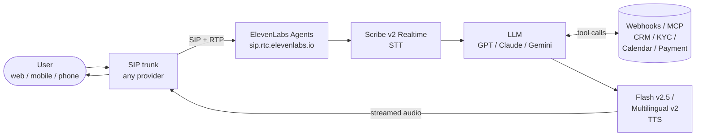

# ElevenLabs Agents Playbook

A practical, production-grade playbook for building conversational voice AI agents on **ElevenLabs Agents Platform** — with telephony when you need it.

Not a doc clone. Not a course. A curated developer playbook that bridges what the official docs say (ideal-condition latency, model specs) and what production voice agents actually behave like (jitter, codec transcoding, regional clusters, carrier hops, multilingual quality variance).

---

## Who this is for

Engineers shipping production voice agents who need:
- Architecture clarity (what the ElevenLabs stack actually looks like end-to-end)
- Honest latency numbers (not just inference — the full glass-to-glass pipeline)
- SIP / telephony depth (because this is where most "AI voice apps" silently break)
- Cost predictability (per-minute, per-character, telephony — all together)
- Multilingual realism — including code-switching languages like Hinglish

If you've ever shipped an agent that sounded great in the browser and felt sluggish on a phone call, this playbook is the missing layer.

---

## Prerequisites

Before you start the quickstart, you'll need:

- **ElevenLabs account** with at least the free tier — [sign up](https://elevenlabs.io/) (a paid tier is required to use library voices in production calls)
- **(Telephony use cases only)** a SIP trunk provider account — any standards-compliant SIP trunk works
- **A phone number (DID)** from your trunk provider in E.164 format (e.g. `+919876543210`)
- **A phone you can answer** for the test call
- *(Optional)* an LLM provider key if you want to bring your own (OpenAI / Anthropic / Google) — ElevenLabs ships defaults if you skip this

New to the terminology? See [`/resources/GLOSSARY.md`](./resources/GLOSSARY.md) for one-line definitions of DID, RTP, SIP, PSTN, TTFB, TTFT, IVR, VAD, WER, and the rest.

---

## The voice AI stack

For browser/mobile agents the SIP trunk is replaced by WebRTC via the ElevenLabs SDK. Everything else is identical.

Everything in this playbook explains, optimizes, or troubleshoots one of those arrows.

---

## 15-minute quickstart

Five steps. Each links to the deep section.

### 1. Pick & create a voice — [`/getting-started`](./getting-started/README.md)

Default voice → fastest. Instant Voice Clone → ~1–2 min of clean audio. Professional Voice Clone → 30 min minimum (slower per generation). Voice Design → describe a voice in 20–1000 chars and pick from 3 previews.

### 2. Create your agent — [`/getting-started`](./getting-started/README.md)

System prompt, first message, language, LLM, interruption toggle. Defaults work; the dashboard tester is enough to iterate.

### 3. Connect telephony (if you need it) — [`/telephony-and-sip`](./telephony-and-sip/README.md)

For phone agents: ElevenLabs' SIP endpoint is `sip.rtc.elevenlabs.io`. Point **any standards-compliant SIP trunk** at it, import the DID into ElevenLabs, attach it to your agent. For browser/mobile agents, use the ElevenLabs SDK — no SIP needed.

### 4. Add tools & workflows — [`/tools-and-workflows`](./tools-and-workflows/README.md)

Everything below is **built into the agent's Tools tab in the ElevenLabs dashboard** — links go to the official docs.

#### Built-in [**System tools**](https://elevenlabs.io/docs/agents-platform/customization/tools/system-tools) (toggle on/off per agent)

| Tool | What it does | Official docs |
|---|---|---|
| **End conversation** | Agent autonomously hangs up when the conversation is complete | [docs](https://elevenlabs.io/docs/agents-platform/customization/tools/system-tools/end-call) |
| **Detect language** | Classify the user's spoken language mid-call and switch register | [docs](https://elevenlabs.io/docs/eleven-agents/customization/tools/system-tools/language-detection) |
| **Skip turn** | Agent intentionally stays silent for a turn (banking pause, sympathetic moment) | [docs](https://elevenlabs.io/docs/agents-platform/customization/tools/system-tools/skip-turn) |
| **Update state** | Write structured key-value data (e.g. `{"kyc_done": true}`) into per-call state | [docs](https://elevenlabs.io/docs/agents-platform/customization/tools/system-tools) |
| **Transfer to agent** | Hand off to another ElevenLabs agent with full conversation context | [docs](https://elevenlabs.io/docs/eleven-agents/customization/tools/system-tools/agent-transfer) |
| **Transfer to number** | SIP REFER the call to a real phone number / human | [docs](https://elevenlabs.io/docs/eleven-agents/customization/tools/system-tools/transfer-to-number) |
| **Play keypad touch tone** | Generate DTMF digits to navigate downstream IVRs | [docs](https://elevenlabs.io/docs/eleven-agents/customization/tools/system-tools/play-keypad-touch-tone) |
| **Voicemail detection** | Classify human pickup vs. voicemail on outbound calls | [docs](https://elevenlabs.io/docs/agents-platform/customization/tools/system-tools/voicemail-detection) |

#### [**Server tools**](https://elevenlabs.io/docs/agents-platform/customization/tools/server-tools) (you define — HTTPS webhooks to your backend)
Use for anything that needs your data or third-party APIs:
- CRM lookup by caller phone number
- KYC / identity verification
- Order status, payment status, refund processing
- Calendar booking (Cal.com / Google Calendar)
- Ticket creation in your support system

The LLM constructs the request, hits your endpoint, and incorporates the response into the conversation.

#### [**Client tools**](https://elevenlabs.io/docs/eleven-agents/customization/tools/client-tools) (frontend SDK only, not for phone)
Execute functions in the browser / mobile SDK that hosts the agent. DOM manipulation, in-app navigation, reading frontend state. Not applicable to PSTN calls.

#### [**MCP tools**](https://elevenlabs.io/docs/eleven-agents/customization/tools/mcp) (external tool surface)
Bring a Model Context Protocol server into the agent at runtime. Examples:
- **Zapier MCP** — one integration → 7,000+ apps as tools
- **Custom MCP** — your own internal platform exposed as a single MCP

Configurable approval modes (Always Ask / Fine-grained / No Approval). **Note:** MCP is not supported in Zero-Retention or HIPAA deployments.

#### [**Workflows**](https://elevenlabs.io/docs/agents-platform/customization/agent-workflows) (visual graph for multi-intent / branching)
Use when a single agent's prompt is becoming an `IF this THEN that` tangle. Each node has its own system prompt, voice, tools, LLM. Transitions are conditional (intent classification, tool return value, LLM decision). Recommended for support + sales + KYC on the same DID — each as a specialist agent with clean handoffs.

#### Reference: [official Tools overview](https://elevenlabs.io/docs/agents-platform/customization/tools)

### 5. Test & instrument — [`/production-best-practices`](./production-best-practices/README.md)

Natural turn-taking sits between **200–500ms**; users start interrupting past **~1000ms glass-to-glass**. Watch transcripts, post-call webhooks, and per-leg latency.

---

## Section index

| Section | What's in it |
|---|---|
| [`/getting-started`](./getting-started/README.md) | Voice + agent setup, dashboard-first |
| [`/models-and-latency`](./models-and-latency/README.md) | Flash / Turbo / Multilingual v2 / v3 comparison + the full latency pipeline (Mermaid). The single most useful technical doc here. |
| [`/telephony-and-sip`](./telephony-and-sip/README.md) | SIP basics, **Vobiz deep dive**, transfer flows, why telephony feels slower than browser AI |
| [`/multilingual`](./multilingual/README.md) | Hindi / Hinglish / Tamil / Kannada / Bengali — quality ratings, code-switching, STT WER |
| [`/tools-and-workflows`](./tools-and-workflows/README.md) | Server/client/system tools, workflows, post-call webhooks, trust_context |
| [`/cost-analysis`](./cost-analysis/README.md) | Pricing model + 3 real scenarios (support bot / India multilingual / call center) |
| [`/production-best-practices`](./production-best-practices/README.md) | Latency budget, observability, failure modes, compliance |
| [`/prompt-patterns`](./prompt-patterns/README.md) | 5 reusable prompt templates (support, KYC, sales, booking, code-switching) |
| [`/mcp-integration`](./mcp-integration/README.md) | Official ElevenLabs MCP — for **ops** (manage voices/agents/calls from Claude/Cursor), not agent runtime |
| [`/benchmarks`](./benchmarks/README.md) | Repeatable harness for measuring STT/LLM/TTS latency directly — bypasses orchestrators |
| [`/resources`](./resources/README.md) | Curated source-of-truth index, grouped |

---

## Sources of truth

- ElevenLabs docs root: https://elevenlabs.io/docs/overview/intro
- Agents Platform: https://elevenlabs.io/docs/agents-platform/overview
- ElevenAgents (newer): https://elevenlabs.io/docs/eleven-agents/overview
- Full link index: [`/resources`](./resources/README.md)

---

*Built by [Piyush Sahoo](https://www.linkedin.com/in/piyush-s713/) — connect on LinkedIn.*