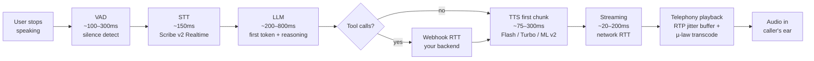

# Models & Latency

The single most useful technical section here. If you only read one folder, read this one.

> **Note on measurement methodology:** the production setup is `SIP trunk → ElevenLabs Agents Platform` direct (see [`/telephony-and-sip`](../telephony-and-sip/README.md)). The per-component latency numbers below come from real outbound calls instrumented for component-level timing (STT / LLM / TTS / endpointing / total turn). TTS leg numbers represent ElevenLabs' actual TTS code path.

---

## The core insight

> **Total conversational latency ≠ TTS model latency.**

Official numbers (like Flash v2.5's "~75ms") measure **model inference only** for short inputs. Production conversational latency is the full **glass-to-glass pipeline** — from the moment the user stops speaking to the moment audio plays back in their ear.

A model that benchmarks at 75ms can still feel like 1.2 seconds on a phone call. The difference is the pipeline.

---

## The full latency pipeline

Every box is a tunable knob. The fastest path through the pipeline is dictated by the **slowest** stage — usually the LLM or the telephony layer, not TTS.

---

## Model comparison — claim vs actual

Spec column from the official [models reference](https://elevenlabs.io/docs/overview/models). **Actual column from our own outbound-call benchmarks** (8 isolated lab calls, same STT + LLM + prompt + voiceId, only TTS varies; audio in [`/benchmarks/recordings`](../benchmarks/recordings/INDEX.md)). Third-party column from external benchmarks where they exist.

| Model | Claim (ElevenLabs) | **Actual (our lab, TTS leg)** |
|---|---|---|
| **Flash v2** | ~75 ms (inference only) | **319 ms** |
| **Flash v2.5** | ~75 ms (inference only) | **290 ms** |
| **Turbo v2** | ~300 ms inference | **296 ms** |
| **Turbo v2.5** | ~300 ms inference | **291 ms** |
| **Multilingual v2** | "Higher (varies)" — no specific number | **578 ms** |
| **Eleven English v1** (legacy) | not published | **969 ms** |
| **Eleven v3** | "Higher first-token latency" — no specific number | **1,786 ms** |

### Third-party benchmarks

Independent reviewers report similar gaps between vendor claims and measured latency:

- **Vexyl AI** (Jan 2026, India test): measured Turbo v2.5 at **478 ms TTFB** via streaming REST with PCM format — close to our 291 ms TTS-leg number once accounting for what each measures. → [vexyl.ai](https://vexyl.ai/elevenlabs-tts-latency-test-2026-real-world-results/)
- **Podcastle** (streaming TTS benchmark): Flash v2.5 outperformed on prosody Elo, but **AsyncFlow was ~34 % faster on median TTFB**. → [podcastle.ai](https://podcastle.ai/blog/tts-latency-vs-quality-benchmark/)
- **Artificial Analysis** TTS arena: ranks ElevenLabs v3 at Elo 1196 on quality but excludes it from the realtime category — consistent with our 1,786 ms measurement. → [artificialanalysis.ai](https://artificialanalysis.ai/text-to-speech/model-families/elevenlabs)
- **Inworld AI** comparison: estimates Multilingual v2 at >500 ms P90 time-to-first-audio (not officially published by ElevenLabs). → [inworld.ai](https://inworld.ai/resources/inworld-tts-1-5-max-vs-elevenlabs-multilingual-v2-greater-than-20x-cheaper-higher-quality)

### Reading the table

- **The "~75 ms" Flash claim is inference only.** Production reality is **290–319 ms** TTS-leg latency, ~4× the spec. Same model — the gap is network + orchestrator + TLS handshake + jitter buffer.
- **The Flash vs Turbo "spec gap" (75 vs 300 ms) disappears in production.** All four cluster at 290–320 ms TTS leg. Pick on **language coverage and price**, not on latency.
- **Multilingual v2 and v3 are not realtime models.** 578 ms and 1,786 ms TTS legs make them unusable for tight-realtime phone agents. Reserve for narration / audiobook / cinematic.
- **Legacy `eleven_monolingual_v1` is 3× slower than Flash.** Avoid for new projects.

The "best for" recommendation: **Flash v2.5** for almost every production phone-agent deployment. Switch to Multilingual v2 only when prosody is the constraint and you can afford the extra 250+ ms.

### STT side

| Model | Latency | Languages | Realtime |
|---|---|---|---|
| **Scribe v2** | — | 90+ | No (batch) |
| **Scribe v2 Realtime** | ~150ms | 90+ (incl. 11 Indian) | ✅ Yes — this is what the Agents Platform uses |

---

## Real-world observations

Three measured assistant configurations, same orchestrator and region:

| Assistant config | STT | LLM | TTS | **Total avg latency** |
|---|---|---|---|---|
| **Bella** | — | — | Eleven Turbo v2 (**400 ms** voice leg) | — |
| **Alice** | — | — | Eleven **Multilingual v2** (**1,200 ms** voice leg) | **~1,790 ms** |
| **New Assistant (Hindi)** | Deepgram nova-3 (**100 ms**) | GPT-4o-mini (**390 ms**) | Eleven **Flash v2** (**75 ms**) | **~665 ms** |

The headline result: **swapping only the TTS model from Multilingual v2 → Flash v2 dropped total assistant latency from ~1,790 ms to ~665 ms — a 1,125 ms improvement from one config change.** Same STT, same LLM provider, same orchestrator. That delta is the single strongest argument in this playbook for defaulting to Flash on phone agents.

**1,790 ms is well past the ~1,000 ms glass-to-glass ceiling** at which users start interrupting because they think the AI didn't hear them ([`/production-best-practices`](../production-best-practices/README.md#latency-budget)). **665 ms is comfortably under it.**

Implications:
- **Multilingual v2 is not viable for tight-realtime phone agents** at this latency profile. 1,200 ms on the voice leg alone leaves zero budget for STT + LLM + telephony.
- **Turbo v2 at 400 ms** is workable, but only if LLM + STT + telephony stay under 600 ms combined. Tight.
- **Flash v2 / v2.5 at ~75 ms** is the only ElevenLabs TTS that gives realistic headroom for sub-1000ms total. Confirmed in production via the 665 ms measurement.
- **The LLM is the next-biggest lever after TTS.** In the 665 ms breakdown, GPT-4o-mini ate 390 ms — more than 5× the TTS. For Hindi/Hinglish flows, a cheaper LLM (4.1-nano) or shorter prompts could plausibly trim another 100–200 ms.

The delta between spec and observed:
- Network RTT (orchestrator region → ElevenLabs region → back)
- WebSocket connection setup if not pooled
- Telephony streaming buffer
- VAD silence detection on the inbound side

**Lesson:** when docs say "~75ms" or "~300ms", that's inference only. Add 200–600 ms (Flash/Turbo) or **800–1500 ms (Multilingual v2)** for everything else before you have a glass-to-glass number.

---

## Production latency by stack — measured across 200 calls

Pulled from per-call `performanceMetrics` for the window **2026-03-27 → 2026-05-02**. Component latency is the per-turn average.

| Assistant | STT | LLM | TTS | n calls (measurable) | STT ms | LLM ms | TTS ms | Endpoint ms | **Total turn ms** |
|---|---|---|---|---:|---:|---:|---:|---:|---:|
| **New Assistant** (Hindi) | Deepgram nova-3-general | OpenAI gpt-4o-mini | **11labs eleven_flash_v2** | 3 | 151 | 514 | 532 | 101 | **1,224** |
| **Short-call test agent** | Google gemini-2.0-flash | OpenAI gpt-5.4-mini | LMNT morgan | 20 | — | 966 | 201 | 100 | **1,299** |
| **India billing agent** | Deepgram flux-general-en | OpenAI gpt-4o-mini | MiniMax speech-02-turbo (PVC) | 14 | 318 | 494 | 460 | — | **1,679** |

The earlier reported "665 ms" dashboard snapshot for the same Hindi/Flash v2 stack averaged 1,224 ms over a longer call window — meaning the dashboard's "average" number swings significantly with the call sample. **Always look at the full window, not a single screenshot.**

Cross-stack reads:
- **TTS dominates in two of three configs.** Flash v2 (532 ms in production, vs spec 75 ms inference) and MiniMax PVC (460 ms) both eat large fractions of the budget. Only LMNT was actually fast (201 ms).
- **LLM is the other big one.** gpt-4o-mini ran ~500 ms; gpt-5.4-mini ran ~966 ms — nearly 2× slower despite both being "mini" tiers. Always benchmark; don't trust the marketing tier name.
- **None of these three configs land under the 1,000 ms ceiling.** All three would benefit from Flash v2.5 + a lighter LLM (e.g. gpt-4.1-nano).

To run your own measurements across arbitrary (STT × LLM × TTS) combinations, see [`/benchmarks`](../benchmarks/README.md).

---

## Lab-clean measurements — 8 isolated TTS benchmarks

Measured 2026-05-16, India region, real outbound PSTN calls. **All 8 calls share the same STT (Deepgram nova-3, en) + same LLM (gpt-4o-mini) + same minimal "latency test" prompt + same voiceId.** Only the **ElevenLabs TTS model** varies. Audio in [`/benchmarks/recordings`](../benchmarks/recordings/INDEX.md).

| Rank | TTS Model | TTS leg | Turn total | Realtime verdict |
|---:|---|---:|---:|---|
| 🥇 | **eleven_flash_v2_5** | **290 ms** | **934 ms** | ✅ Production default |
| 🥇 | **eleven_turbo_v2_5** | **291 ms** | **915 ms** | ✅ Tied with Flash |
| 3 | eleven_turbo_v2 | 296 ms | 1,405 ms | English-only |
| 4 | eleven_flash_v2 | 319 ms | 965 ms | English-only |
| 5 | eleven_multilingual_v2 | 578 ms | 1,353 ms | ⚠️ Quality, not speed |
| 6 | eleven_monolingual_v1 (legacy) | 969 ms | 1,582 ms | ❌ Avoid |
| 7 | eleven_v3 (experimental) | **1,786 ms** | **2,412 ms** | ❌❌ Never realtime |

Hindi context (Deepgram nova-2 hi + Multilingual v2): **TTS 684 ms / TURN 1,662 ms** — Hindi adds ~370 ms pipeline cost vs English (mostly STT + LLM, only +106 ms on TTS).

### Key findings from the lab matrix

1. **The four "fast" ElevenLabs models are indistinguishable in production.** Flash v2 / Flash v2.5 / Turbo v2 / Turbo v2.5 cluster at 290–320 ms TTS leg (10% spread). The marketing gap between Flash (~75 ms inference) and Turbo (~300 ms inference) **disappears** once you add orchestrator + telephony + network. **Pick on language coverage and price, not on Flash-vs-Turbo latency.**
2. **Multilingual v2 is 2× slower** (578 ms vs ~290 ms) — use it only when its prosody is required. Production TTS budget shouldn't allocate it for routine support agents.
3. **v3 is unusable for phone agents.** 1,786 ms TTS leg, 2,412 ms total — users would think the line is dead. Reserve for non-realtime (audiobook, narration).
4. **Legacy `eleven_monolingual_v1` is 3× slower** than Flash. Don't pick it from dropdowns just because it's there.

---

## Prompt size and LLM latency — myth busted

Tested gpt-4o-mini across three prompt sizes, all other variables held constant:

| Prompt tokens | LLM avg | Source |
|---:|---:|---|
| ~30 (clean lab) | 290–360 ms | bench-flash-v2-5 / turbo-v2-5 / multilingual-v2 |
| ~5.6k–8k (bloated lab) | 313–334 ms | bloat-flash-v2-5 / turbo-v2-5 |
| **~100k** (Cathrine production) | **554 ms** | Cathrine assistant (5k-line outbound sales prompt) |

**Conclusion: prompt size does NOT meaningfully affect LLM latency up to ~8k tokens on gpt-4o-mini.** The conventional wisdom "trim your prompts for speed" is wrong at the everyday-production scale. The pain only kicks in past ~50k tokens, where it adds ~200 ms.

**What to actually do:**
- Stop optimizing 800-token prompts hoping for latency wins — there are none.
- Do optimize ~100k prompts (they're real cost).
- Spend that effort on **picking Flash v2.5 over Multilingual v2**, **trimming endpointing config**, or **caching frequent phrases** — those are the real levers.

---

## Model selection cheat sheet

| Scenario | Pick |
|---|---|
| Realtime English support agent | **Flash v2.5** |
| India multilingual (Hindi/Hinglish/Tamil…) | **Flash v2.5** for speed; **Multilingual v2** if Flash's prosody drifts |
| Outbound sales, high call volume | **Flash v2.5** + lighter LLM (cost) |
| Premium concierge / IVR with brand voice | **Multilingual v2** with PVC |
| Audiobook or narration generation | **Eleven v3** (not Agents Platform) |
| Cost-optimized at scale | **Flash v2.5** + Business tier ($0.08/min — see [`/cost-analysis`](../cost-analysis/README.md)) |

---

## Latency knobs you actually have

1. **`optimize_streaming_latency`** (0–3) — trade quality for speed. Level 3 can shave 50–75ms off TTFB with minimal perceptual quality loss for conversational content.
2. **Voice type hierarchy** — Default > Synthetic > IVC > PVC (fastest → slowest). PVC's per-generation overhead is real; pick IVC for phone agents unless you genuinely need PVC.
3. **Persistent HTTPS / keep-alive** — the 375ms TCP-handshake overhead **only hits new connections**. Reuse connections across turns in a session.
4. **Regional routing** — ElevenLabs runs clusters in USA, Netherlands, Singapore, and India. Latency floor is ~20ms within-region, 100–200ms cross-region. Pin to the nearest cluster.
5. **Phrase caching** — pre-generate common responses ("one moment", "let me check that") and play from cache. 90% hit rate is achievable on repetitive flows.
6. **Speak-on-comma** — Agents now start synthesizing after the LLM emits "enough words and a comma" rather than waiting for a full sentence.

---

## Sources of truth

- [Models reference](https://elevenlabs.io/docs/overview/models)
- [Help Center models comparison](https://help.elevenlabs.io/hc/en-us/articles/17883183930129)
- [Understanding latency](https://elevenlabs.io/docs/eleven-api/concepts/latency)
- [Latency optimization best practices](https://elevenlabs.io/docs/eleven-api/guides/how-to/best-practices/latency-optimization)
- [Flash 75ms launch (The Batch)](https://www.deeplearning.ai/the-batch/elevenlabs-drops-latency-to-75-milliseconds/)

Full index: [`/resources`](../resources/README.md).

---

*Built by [Piyush Sahoo](https://www.linkedin.com/in/piyush-s713/) — connect on LinkedIn.*