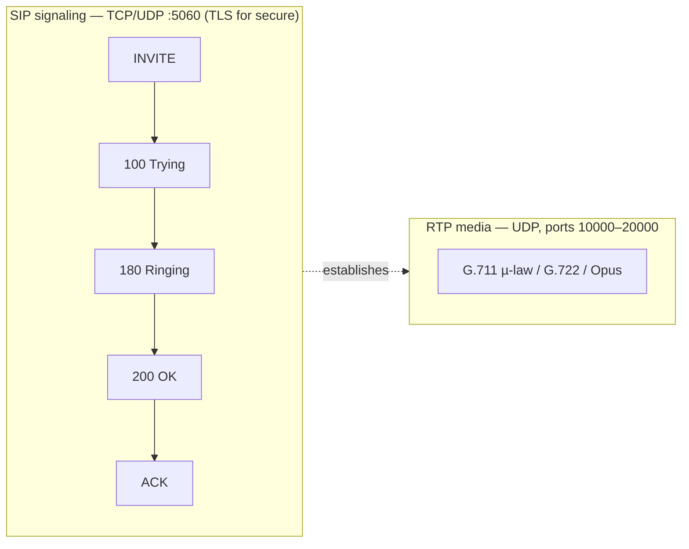
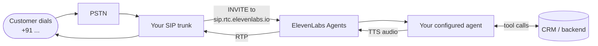

# Telephony & SIP

The moat. Most "AI voice" projects underestimate this layer — and that's where production agents quietly fall apart.

> **ElevenLabs Agents Platform is the orchestrator.** STT, LLM routing, TTS, conversation state, tools, and telephony integration all live inside ElevenLabs. The SIP trunk connects directly to `sip.rtc.elevenlabs.io`. No middleware in the production path.

---

## SIP in 60 seconds

SIP (Session Initiation Protocol) is the signaling layer that **sets up, modifies, and tears down** voice sessions over IP. The actual audio is carried over **RTP** (Real-time Transport Protocol). Media runs on **UDP** — TCP retransmission overhead would cause unacceptable jitter for real-time audio. SIP signaling itself runs over UDP, TCP, or TLS.

Key parameters:
- **DID** — the phone number callers dial
- **SIP trunk** — the logical pipe between your provider and ElevenLabs
- **FQDN** — ElevenLabs: `sip.rtc.elevenlabs.io`
- **Transport** — TCP is common; TLS + SRTP for production-grade encryption
- **Codec** — G.711 µ-law (8 kHz, PSTN default), G.722 (wideband), Opus where supported

---

## Inbound flow

**Generic setup:**
1. Buy a DID from a SIP trunk provider (E.164 format, e.g. `+919876543210`)
2. Point the trunk's inbound destination at `sip.rtc.elevenlabs.io:5060`
3. In the ElevenLabs Dashboard → **Phone Numbers** → **Import from SIP Trunk**, label and import the number
4. **Attach** the imported number to an agent
5. Test by dialing the DID

---

## Outbound flow

Outbound is triggered via the [outbound SIP API](https://elevenlabs.io/docs/api-reference/sip-trunk/outbound-call) — one POST with agent ID + destination number. Or from the Dashboard: **Phone Numbers** → **Make Outbound Call**.

---

## Transfer patterns

| Pattern | When | How |
|---|---|---|
| **AI → Human (warm)** | Escalation with context handoff | [`transfer_to_human`](https://elevenlabs.io/docs/agents-platform/customization/tools/system-tools/transfer-to-human) — agent passes summary, then bridges |
| **AI → Human (cold)** | Department routing | [`transfer_to_number`](https://elevenlabs.io/docs/eleven-agents/customization/tools/system-tools/transfer-to-number) — pure SIP REFER |
| **Human → AI** | Front-of-funnel triage | Your IVR routes to the ElevenLabs DID |
| **AI → AI** | Specialist sub-agents | `transfer_to_agent` system tool — context carries over |

---

## SIP trunk provider

ElevenLabs is compatible with any standards-compliant SIP trunk. The two named in this playbook are **Twilio** (global incumbent) and **Vobiz** (India-focused). Anything that speaks SIP can point at `sip.rtc.elevenlabs.io`.

**For India deployments**, [Vobiz](https://www.vobiz.ai/) is one option — a Bengaluru-based SIP trunk focused on AI voice agents. Their site publishes sub-80 ms end-to-end latency; benchmark in your own region and call pattern before relying on that figure. Setup is dashboard-based via ElevenLabs' **Import from SIP Trunk** flow; for the exact field values, see the [Vobiz × ElevenLabs integration guide](https://www.docs.vobiz.ai/integrations/elevenlabs-dashboard).

Other providers follow the same `Import from SIP Trunk` pattern with their own credentials.

---

## Why telephony feels slower than browser AI

The browser tester in the ElevenLabs Dashboard goes:
`Mic → WebRTC → ElevenLabs cluster → TTS → WebRTC → Speaker` — within-region, no transcoding, ~250–400 ms total.

A real phone call goes:
`Mic → PSTN carrier → Carrier hops → SIP trunk → ElevenLabs → ... → SIP trunk → Carrier → PSTN → Mic`

Sources of added latency that don't exist in the browser:
- **RTP jitter buffer** — typically 60–200 ms on the receiving side
- **µ-law transcoding to 8 kHz** — quality drop + processing cost
- **PSTN carrier routing** — multiple hops, each adding 20–80 ms
- **Codec re-negotiation** if trunk and agent disagree
- **No WebRTC adaptive bitrate** — fixed-rate audio

**Observed threshold:** natural turn-taking sits in **200–500 ms**. Past **~1,000 ms glass-to-glass**, users start interrupting because they assume the AI didn't hear them. Hard budget — see [`/models-and-latency`](../models-and-latency/README.md).

---

## Security checklist

- **TLS transport + SRTP** for production (end-to-end encryption of signaling and media)
- IP allowlisting using ElevenLabs' published /24 block + your trunk provider's gateway hostname
- Digest auth on outbound (prevents toll fraud)
- Disable international dialing unless explicitly needed
- Rotate SIP credentials periodically
- For PCI / banking — use the `play_dtmf` system tool for keypad-only card entry, keeping the audio out of scope

---

## Common troubleshooting

| Symptom | Likely cause | Fix |
|---|---|---|
| SIP 408 (timeout) | Trunk can't reach ElevenLabs | Check FQDN, transport, trunk-status |
| SIP authentication failed | Wrong credentials | Re-paste username/password (case-sensitive) |
| Call connects but silent | Agent misconfigured | Confirm First Message + voice + LLM are set |
| Call doesn't connect | Bad phone format / inactive trunk | E.164 (`+91...`) or local; confirm trunk active |
| One-way audio | NAT / firewall blocking RTP | Open UDP 10000–20000 outbound |

---

## Sources of truth

- [ElevenLabs SIP trunking docs](https://elevenlabs.io/docs/agents-platform/phone-numbers/sip-trunking)
- [Outbound SIP API](https://elevenlabs.io/docs/api-reference/sip-trunk/outbound-call)
- [Transfer to human](https://elevenlabs.io/docs/agents-platform/customization/tools/system-tools/transfer-to-human)
- [Transfer to number](https://elevenlabs.io/docs/eleven-agents/customization/tools/system-tools/transfer-to-number)
- [SIP trunking integrations index](https://elevenlabs.io/agents/integrations/sip-trunking)
- [Vobiz × ElevenLabs setup (external)](https://www.docs.vobiz.ai/integrations/elevenlabs-dashboard)

Full index: [`/resources`](../resources/README.md).

---

*Built by [Piyush Sahoo](https://www.linkedin.com/in/piyush-s713/) — connect on LinkedIn.*